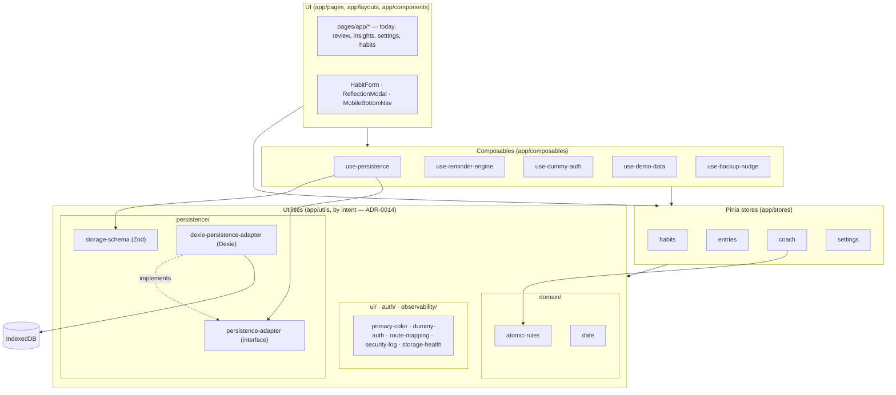
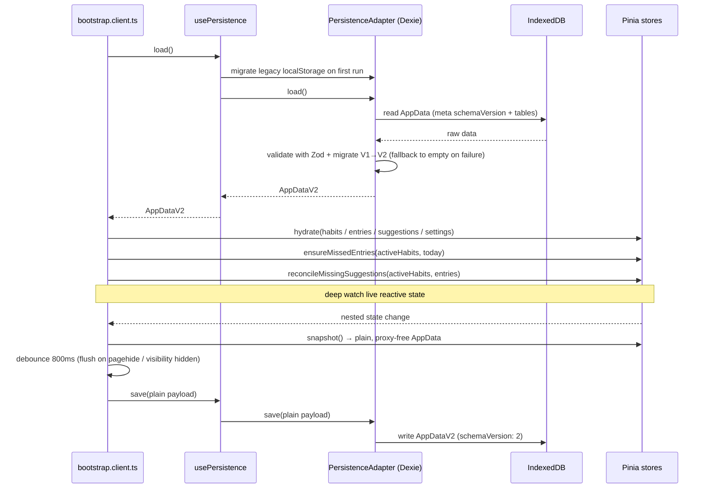
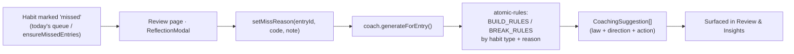

# Architecture

A client-only Nuxt 4 SPA (`ssr: false`) with all state in the browser. This page shows how the
pieces fit together; the *why* is in [adr/](adr/).

## Layer map

Pages and layouts render reactive Pinia state. Stores are the single source of truth.
Composables wrap cross-cutting concerns (persistence, reminders, auth, demo data). Pure
utilities sit underneath, and Dexie/IndexedDB is the default storage floor — reached through a
`PersistenceAdapter` interface so the backend can be swapped (see [ADR-0009](adr/0009-persistence-adapter-interface.md)).

## Startup & persistence loop

The client plugin `app/plugins/bootstrap.client.ts` owns the lifecycle: load once, hydrate the
stores, reconcile derived state, then persist changes back on a debounce.

The deep `watch` source is the **live reactive store state** (`habitsStore.habits`,
`entriesStore.entries`, `coachStore.suggestions`, `settingsStore.settings`), so Vue's
traversal collects dependencies on in-place field mutations (e.g. `habit.name = ...`).
Only once a change fires does the callback build the plain `AppData` payload from each
store's `snapshot()`. Per [adr/0004](adr/0004-pinia-stores-with-snapshot-persistence.md),
`snapshot()` returns a `structuredClone(toRaw(...))` deep clone — plain, proxy-free, and
structured-clonable — so the [adapter](adr/0009-persistence-adapter-interface.md) writes it
straight to its backend without stripping Vue proxies. Reactive tracking is a bootstrap
concern; serialization is a store concern.

The persisted envelope is **`AppDataV2`** (`{ schemaVersion: 2, habits, entries, suggestions,
settings }`). Each `Habit` carries a `pauses: HabitPause[]` list of inclusive `YYYY-MM-DD`
ranges; days inside a pause are never *due*. Stored V1 payloads and legacy `localStorage`
migrate up via a one-way `migrateToV2` inside `parseAppData`
(see [adr/0010](adr/0010-appdatav2-flexible-schedules-pause-ranges.md) and
[adr/0006](adr/0006-zod-validated-versioned-data-schema.md)).

## Resilience & update flows

Two cross-cutting, client-only flows guard the local-first model:

- **Storage health (SEC-18).** The debounced `save()` in `bootstrap.client.ts` routes write
  failures (especially `QuotaExceededError`) and a best-effort `navigator.storage.estimate()`
  pre-check through `useStorageHealth()`. `app/layouts/app.vue` watches its reactive
  `lastError` / `isQuotaLow` and raises a `useToast()` warning so the user can export and prune.
- **Service-worker update prompt (SEC-14).** With `registerType: 'prompt'`, a new worker is
  precached but held; `usePwaUpdate()` (wrapping `$pwa.needRefresh`) drives a reload banner in
  the app layout and applies the waiting worker only on user confirmation.

Both, plus auth and import/export/delete actions, emit structured events into the in-memory
security log (`app/utils/observability/security-log.ts`, SEC-16) — a bounded ring buffer with a console sink,
no network and no persistence.

## Coaching flow

Missing a habit and recording *why* deterministically produces suggestions — no LLM, no
network (see [ADR-0005](adr/0005-deterministic-atomic-habits-coaching-engine.md)).

## Routing

File-based routing under `app/pages/`. Public: `/`, `/login`. Protected (gated by
`app/middleware/auth.global.ts`): `/app`, `/app/habits`, `/app/habits/new`,
`/app/habits/[id]`, `/app/review`, `/app/insights`, `/app/settings`. The middleware also maps
legacy top-level paths (e.g. `/habits` → `/app/habits`) via `app/utils/auth/route-mapping.ts`.

## Related

- Decisions: [adr/](adr/)
- Domain terms: [glossary.md](glossary.md)
- Security model: [../SECURITY.md](../SECURITY.md)
