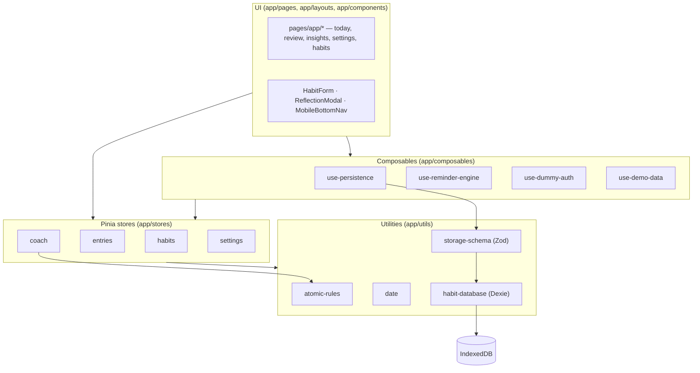
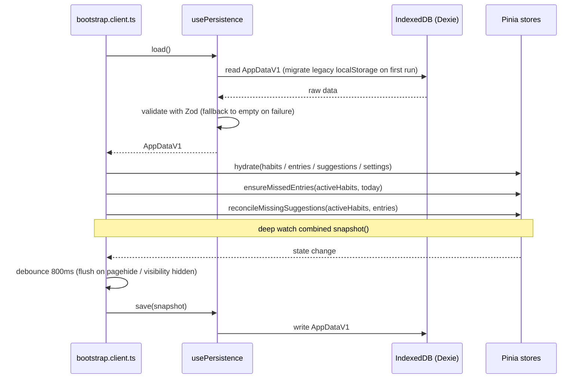
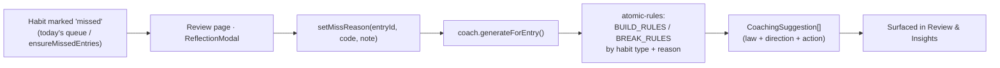

# Architecture

A client-only Nuxt 4 SPA (`ssr: false`) with all state in the browser. This page shows how the
pieces fit together; the *why* is in [adr/](adr/).

## Layer map

Pages and layouts render reactive Pinia state. Stores are the single source of truth.
Composables wrap cross-cutting concerns (persistence, reminders, auth, demo data). Pure
utilities sit underneath, and Dexie/IndexedDB is the storage floor.

## Startup & persistence loop

The client plugin `app/plugins/bootstrap.client.ts` owns the lifecycle: load once, hydrate the
stores, reconcile derived state, then persist changes back on a debounce.

## Coaching flow

Missing a habit and recording *why* deterministically produces suggestions — no LLM, no
network (see [ADR-0005](adr/0005-deterministic-atomic-habits-coaching-engine.md)).

## Routing

File-based routing under `app/pages/`. Public: `/`, `/login`. Protected (gated by
`app/middleware/auth.global.ts`): `/app`, `/app/habits`, `/app/habits/new`,
`/app/habits/[id]`, `/app/review`, `/app/insights`, `/app/settings`. The middleware also maps
legacy top-level paths (e.g. `/habits` → `/app/habits`) via `app/utils/route-mapping.ts`.

## Related

- Decisions: [adr/](adr/)
- Domain terms: [glossary.md](glossary.md)
- Security model: [../SECURITY.md](../SECURITY.md)
