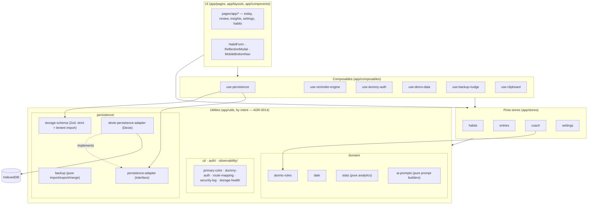
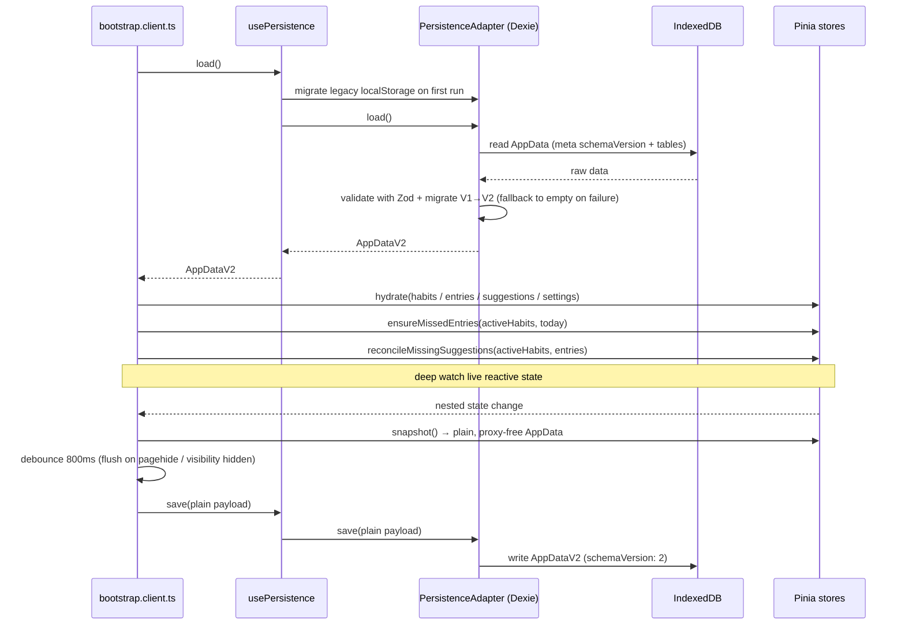
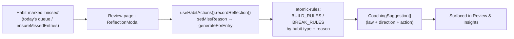

# Architecture

A client-only Nuxt 4 SPA (`ssr: false`) with all state in the browser. This page shows how the
pieces fit together; the *why* is in [adr/](adr/).

## Layer map

Pages and layouts render reactive Pinia state. Stores are the single source of truth.
Composables wrap cross-cutting concerns (persistence, reminders, auth, demo data). Pure
utilities sit underneath, and Dexie/IndexedDB is the default storage floor — reached through a
`PersistenceAdapter` interface so the backend can be swapped (see [ADR-0009](adr/0009-persistence-adapter-interface.md)).

## Startup & persistence loop

The client plugin `app/plugins/bootstrap.client.ts` owns the lifecycle: load once, hydrate the
stores, reconcile derived state, then persist changes back on a debounce.

The deep `watch` source is the **live reactive store state** (`habitsStore.habits`,
`entriesStore.entries`, `coachStore.suggestions`, `settingsStore.settings`), so Vue's
traversal collects dependencies on in-place field mutations (e.g. `habit.name = ...`).
Only once a change fires does the callback build the plain `AppData` payload from each
store's `snapshot()`. Per [adr/0004](adr/0004-pinia-stores-with-snapshot-persistence.md),
`snapshot()` returns a `structuredClone(toRaw(...))` deep clone — plain, proxy-free, and
structured-clonable — so the [adapter](adr/0009-persistence-adapter-interface.md) writes it
straight to its backend without stripping Vue proxies. Reactive tracking is a bootstrap
concern; serialization is a store concern.

The load → hydrate → apply-palette, reconcile, and snapshot steps above are not open-coded in
bootstrap. They are the `replaceAppData()`, `reconcileDerivedState()`, and `snapshotAppData()`
functions of `useAppDataLifecycle()` (`app/composables/use-app-data-lifecycle.ts`), the single
lifecycle seam shared by bootstrap, settings import/delete-all, and demo hydration. The composable
is state-only; UI side effects and `persistence.save()` stay at each call site
(see [adr/0015](adr/0015-app-data-lifecycle-composable.md)).

The persisted envelope is **`AppDataV2`** (`{ schemaVersion: 2, habits, entries, suggestions,
settings }`). Each `Habit` carries a `pauses: HabitPause[]` list of inclusive `YYYY-MM-DD`
ranges; days inside a pause are never *due*. Stored V1 payloads and legacy `localStorage`
migrate up via a one-way `migrateToV2` inside `parseAppData`
(see [adr/0010](adr/0010-appdatav2-flexible-schedules-pause-ranges.md) and
[adr/0006](adr/0006-zod-validated-versioned-data-schema.md)).

The **backup import/export** flow on the settings page is presentation only: the pure,
framework-free `app/utils/persistence/backup.ts` owns `extractImportedHabits`,
`mergeHabitsForImport`, `serializeBackup`, and `backupFilename`, and the AI prompt builders
live in `app/utils/domain/ai-prompts.ts`. A **full** import validates through `parseAppData`
and replaces all state via `useAppDataLifecycle()`; a **habits-only** import maps each raw item
through `LenientHabitImportSchema` — a forgiving Zod counterpart to the strict `HabitSchema`,
key-anchored to it so no future `Habit` field is silently dropped — then merges by id. The page
keeps the UI-boundary side effects (file-size gate, security logging, quota check, backup-nudge,
toasts) at the call sites.

## Resilience & update flows

Two cross-cutting, client-only flows guard the local-first model:

- **Storage health & persistence lifecycle (SEC-18, issue #65).** `useStorageHealth()` tracks a
  `navigator.storage.estimate()` low-quota pre-check plus a first-class persistence lifecycle:
  `ok | saving | failed | unavailable`, with a last-successful-save time. The debounced `save()` in
  `bootstrap.client.ts` drives a framework-free retry/backoff loop
  (`app/utils/persistence/persistence-saver.ts`): a transient write failure retries with exponential
  backoff (base 1s, cap 8s, max 3, ±20% jitter); a `QuotaExceededError` or exhausted retries enter
  the terminal `unavailable` state; a blocked database at startup falls back to empty state
  (`loadAppDataSafely`) rather than white-screening. `PersistenceStatusIndicator.vue` in the app
  shell shows a quiet "Saved · {time}" pill on the happy path and a persistent recovery banner —
  **Export backup** / **Retry now** — when `unavailable`; the transient `lastError` toast is
  suppressed while that banner shows. Entry/exit of degraded mode emit `storage.unavailable` /
  `storage.recovered` security events. See [ADR-0017](adr/0017-persistence-status-lifecycle-retry-backoff.md).
- **Service-worker update prompt (SEC-14).** With `registerType: 'prompt'`, a new worker is
  precached but held; `usePwaUpdate()` (wrapping `$pwa.needRefresh`) drives a reload banner in
  the app layout and applies the waiting worker only on user confirmation.

Both, plus auth and import/export/delete actions, emit structured events into the in-memory
security log (`app/utils/observability/security-log.ts`, SEC-16) — a bounded ring buffer with a console sink,
no network and no persistence.

## Coaching flow

Missing a habit and recording *why* deterministically produces suggestions — no LLM, no
network (see [ADR-0005](adr/0005-deterministic-atomic-habits-coaching-engine.md)). Pages never
combine store mutators by hand: every cross-store entry↔suggestion transaction goes through
`useHabitActions()`, the single owner of the invariant "a suggestion exists iff its entry is a
reflected miss" (see [ADR-0016](adr/0016-habit-action-composable-owns-cross-store-transactions.md)).

Status changes (`recordHabitStatus`), reopen (`reopenEntry`), pause cleanup
(`reconcilePauseCleanup`), and cascade delete (`deleteHabitCascade`) flow through the same
service, which drops any suggestions whose entry is no longer a reflected miss.

## Routing

File-based routing under `app/pages/`. Public: `/`, `/login`. Protected (gated by
`app/middleware/auth.global.ts`): `/app`, `/app/habits`, `/app/habits/new`,
`/app/habits/[id]`, `/app/review`, `/app/insights`, `/app/settings`. The middleware also maps
legacy top-level paths (e.g. `/habits` → `/app/habits`) via `app/utils/auth/route-mapping.ts`.

## Related

- Decisions: [adr/](adr/)
- Domain terms: [glossary.md](glossary.md)
- Security model: [../SECURITY.md](../SECURITY.md)
