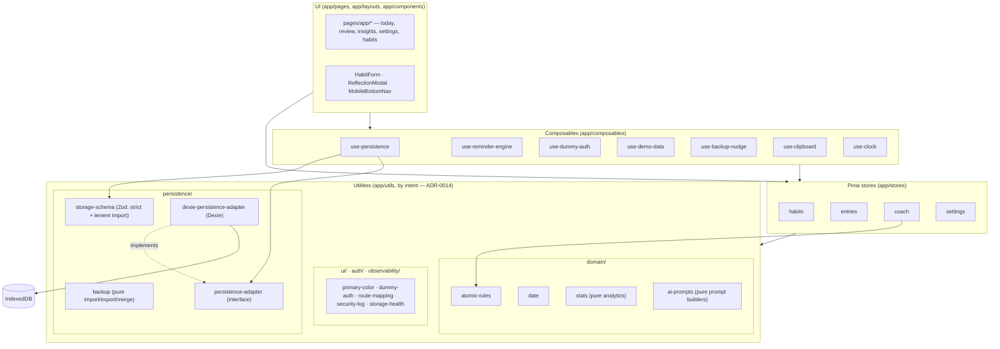
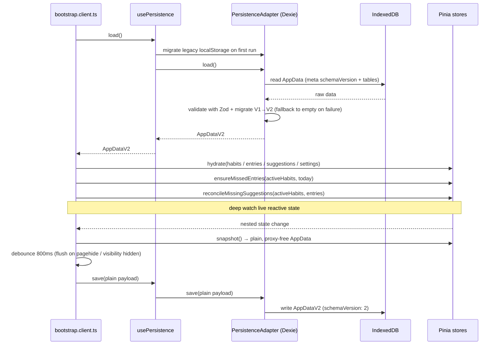
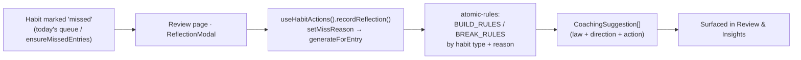

# Architecture

A client-only Nuxt 4 SPA (`ssr: false`) with all state in the browser. This page shows how the
pieces fit together; the *why* is in [adr/](adr/).

## Layer map

Pages and layouts render reactive Pinia state. Stores are the single source of truth.
Composables wrap cross-cutting concerns (persistence, reminders, auth, demo data). Pure
utilities sit underneath, and Dexie/IndexedDB is the default storage floor — reached through a
`PersistenceAdapter` interface so the backend can be swapped (see [ADR-0009](adr/0009-persistence-adapter-interface.md)).

## Startup & persistence loop

The client plugin `app/plugins/bootstrap.client.ts` owns the lifecycle: load once, hydrate the
stores, reconcile derived state, then persist changes back on a debounce.

The deep `watch` source is the **live reactive store state** (`habitsStore.habits`,
`entriesStore.entries`, `coachStore.suggestions`, `settingsStore.settings`), so Vue's
traversal collects dependencies on in-place field mutations (e.g. `habit.name = ...`).
Only once a change fires does the callback build the plain `AppData` payload from each
store's `snapshot()`. Per [adr/0004](adr/0004-pinia-stores-with-snapshot-persistence.md),
`snapshot()` returns a `structuredClone(toRaw(...))` deep clone — plain, proxy-free, and
structured-clonable — so the [adapter](adr/0009-persistence-adapter-interface.md) writes it
straight to its backend without stripping Vue proxies. Reactive tracking is a bootstrap
concern; serialization is a store concern.

The load → hydrate → apply-palette, reconcile, and snapshot steps above are not open-coded in
bootstrap. They are the `replaceAppData()`, `reconcileDerivedState()`, and `snapshotAppData()`
functions of `useAppDataLifecycle()` (`app/composables/use-app-data-lifecycle.ts`), the single
lifecycle seam shared by bootstrap, settings import/delete-all, and demo hydration. The composable
is state-only; UI side effects and `persistence.save()` stay at each call site
(see [adr/0015](adr/0015-app-data-lifecycle-composable.md)).

Every write is **revision-guarded** (see [adr/0024](adr/0024-revision-guarded-saves-with-cross-tab-merge.md)).
The Dexie `meta` table holds a monotonic `revision` counter alongside `schemaVersion`; `load()`
returns `{ data, revision }`, and `save(payload, expectedRevision)` compares-and-swaps the revision
*inside* the write transaction. Bootstrap routes the debounced save through
`useCrossTabSync().saveGuarded`, which passes the tab's last-observed revision: if another tab moved
the stored revision ahead, the write aborts with a `StaleWriteError`, the sync re-loads and runs the
pure three-way `mergeAppData(base, ours, theirs)`, and only a same-record collision is escalated to
the user. Authoritative whole-envelope replacements (import, delete-all, demo, legacy migration) go
through `saveAuthoritative`, which **force-writes** (`expectedRevision: null`) and adopts the new
revision. See *Cross-tab sync* under Resilience below.

### Day rollover

`ensureMissedEntries`/`reconcileMissingSuggestions` above run at startup, but an installed PWA
can stay open across local midnight. The central day-clock service `useClock()`
(`app/composables/use-clock.ts`) owns rollover: a module-singleton reactive `todayKey` advanced
by a `setTimeout` armed to the next local midnight, re-armed on each fire, plus a
`visibilitychange`/`focus` re-check that catches a rollover missed while the tab was suspended.
Bootstrap starts the clock **after** the snapshot watch and registers
`onRollover((key) => reconcileDerivedState(key))`, so a midnight rollover backfills the previous
day's missed entries + coaching and the resulting mutations reach the same debounced save. Every
long-lived, day-scoped consumer — the dashboard, habits list, Insights, the Review 7-day cutoff,
the backup nudge, and the reminder engine — reads the reactive `todayKey` rather than sampling
`todayDateKey()` once, so the whole day-scoped UI rolls over automatically
(see [adr/0018](adr/0018-central-reactive-day-clock-service.md)).

The persisted envelope is **`AppDataV2`** (`{ schemaVersion: 2, habits, entries, suggestions,
settings }`). Each `Habit` carries a `pauses: HabitPause[]` list of inclusive `YYYY-MM-DD`
ranges; days inside a pause are never *due*. Validation and migration go through
`parseAppDataResult`, which returns a discriminated `ok | migrated | unrecoverable`: a stored V1
payload or legacy `localStorage` is upgraded by a version-keyed migration registry (the `v1->v2`
step runs `migrateToV2`), an unrecognised or corrupt payload is `unrecoverable` with an
actionable reason, and `parseAppData` remains a thin throwing wrapper over it
(see [adr/0022](adr/0022-version-keyed-schema-migration-registry.md),
[adr/0010](adr/0010-appdatav2-flexible-schedules-pause-ranges.md), and
[adr/0006](adr/0006-zod-validated-versioned-data-schema.md)).

The **backup import/export** flow on the settings page is presentation only: the pure,
framework-free `app/utils/persistence/backup.ts` owns `extractImportedHabits`,
`mergeHabitsForImport`, `serializeBackup`, and `backupFilename`, and the AI prompt builders
live in `app/utils/domain/ai-prompts.ts`. A **full** import validates through
`parseAppDataResult` — surfacing a migrated backup ("Upgraded from schema v1") or a specific
failure (a newer-version backup vs. a corrupt file) via the pure `describeImportOutcome` helper —
and replaces all state via `useAppDataLifecycle()`; a **habits-only** import maps each raw item
through `LenientHabitImportSchema` — a forgiving Zod counterpart to the strict `HabitSchema`,
key-anchored to it so no future `Habit` field is silently dropped — then merges by id. The page
keeps the UI-boundary side effects (file-size gate, security logging, quota check, backup-nudge,
toasts) at the call sites.

## Resilience & update flows

Two cross-cutting, client-only flows guard the local-first model:

- **Storage health & persistence lifecycle (SEC-18, issue #65).** `useStorageHealth()` tracks a
  `navigator.storage.estimate()` low-quota pre-check plus a first-class persistence lifecycle:
  `ok | saving | failed | unavailable`, with a last-successful-save time. The debounced `save()` in
  `bootstrap.client.ts` drives a framework-free retry/backoff loop
  (`app/utils/persistence/persistence-saver.ts`): a transient write failure retries with exponential
  backoff (base 1s, cap 8s, max 3, ±20% jitter); a `QuotaExceededError` or exhausted retries enter
  the terminal `unavailable` state; a blocked database at startup falls back to empty state
  (`loadAppDataSafely`) rather than white-screening. `PersistenceStatusIndicator.vue` in the app
  shell shows a quiet "Saved · {time}" pill on the happy path and a persistent recovery banner —
  **Export backup** / **Retry now** — when `unavailable`; the transient `lastError` toast is
  suppressed while that banner shows. Entry/exit of degraded mode emit `storage.unavailable` /
  `storage.recovered` security events. See [ADR-0017](adr/0017-persistence-status-lifecycle-retry-backoff.md).
- **Quarantine-on-corrupt & open-failure hardening (issue #66).** When stored data fails Zod
  validation on load, `DexiePersistenceAdapter.load()` preserves the raw payload in a dedicated
  Dexie `quarantine` table (store version 1→2; newest-only; never touched by normal saves) *before*
  falling back to empty state — so a later save can't clobber the recoverable data. `useDataRecovery()`
  surfaces a second, load-time recovery banner on `PersistenceStatusIndicator.vue` — **Export
  preserved data** (downloads the raw JSON) / **Dismiss** (clears quarantine) — kept separate from
  the four-state save lifecycle above. An IndexedDB *open* failure (distinct from a validation
  failure) is caught by `loadAppDataSafely` returning `{ data, failed }`; bootstrap then degrades to
  read-only in-memory mode, suppressing the debounced auto-save watcher (while keeping "Retry now"
  live) so a broken read never clobbers stored data. See
  [ADR-0019](adr/0019-quarantine-invalid-stored-data-on-load-failure.md).
- **Cross-tab sync (issue #67).** Two tabs on the same IndexedDB database were last-writer-wins: a
  stale tab's debounced save silently reverted the other's edits. `useCrossTabSync()`
  (`createCrossTabSync(deps)` factory + singleton, the `use-reminder-engine.ts` pattern) closes that
  window. Every save is revision-guarded (above); a stale write re-loads and runs the pure,
  deterministic `mergeAppData(base, ours, theirs)` (`app/utils/persistence/merge-app-data.ts`) —
  habits keyed by `id`, entries by `habitId:date`, suggestions grouped by `entryId`, settings per
  field — so non-overlapping edits merge silently and only a same-record collision prompts. Idle tabs
  stay fresh: a `BroadcastChannel('habit-tracker:persistence')` "saved" ping
  (`app/utils/persistence/save-broadcast.ts`), plus a `focus`/`visibilitychange` re-check and a 30s
  visible-only poll, re-hydrate a clean tab; a dirty tab defers to the guard. On a real collision the
  bootstrap watcher suspends auto-save and `PersistenceStatusIndicator.vue` shows a third banner —
  **Export this tab's data** / **Reload with latest** — so the newer stored data is never silently
  discarded. Merges/collisions emit `storage.conflict_merged` / `storage.conflict_detected`. See
  [ADR-0024](adr/0024-revision-guarded-saves-with-cross-tab-merge.md).
- **Service-worker update prompt (SEC-14).** With `registerType: 'prompt'`, a new worker is
  precached but held; `usePwaUpdate()` (wrapping `$pwa.needRefresh`) drives a reload banner in
  the app layout and applies the waiting worker only on user confirmation.

Both, plus auth and import/export/delete actions, emit structured events into the in-memory
security log (`app/utils/observability/security-log.ts`, SEC-16) — a bounded ring buffer with a console sink,
no network and no persistence.

## Coaching flow

Missing a habit and recording *why* deterministically produces suggestions — no LLM, no
network (see [ADR-0005](adr/0005-deterministic-atomic-habits-coaching-engine.md)). Pages never
combine store mutators by hand: every cross-store entry↔suggestion transaction goes through
`useHabitActions()`, the single owner of the invariant "a suggestion exists iff its entry is a
reflected miss" (see [ADR-0016](adr/0016-habit-action-composable-owns-cross-store-transactions.md)).

Status changes (`recordHabitStatus`), reopen (`reopenEntry`), pause cleanup
(`reconcilePauseCleanup`), and cascade delete (`deleteHabitCascade`) flow through the same
service, which drops any suggestions whose entry is no longer a reflected miss.

## Routing

File-based routing under `app/pages/`. Public: `/`, `/login`. Protected (gated by
`app/middleware/auth.global.ts`): `/app`, `/app/habits`, `/app/habits/new`,
`/app/habits/[id]`, `/app/review`, `/app/insights`, `/app/settings`. The middleware also maps
legacy top-level paths (e.g. `/habits` → `/app/habits`) via `app/utils/auth/route-mapping.ts`.

## Deployment & CI

`.github/workflows/ci.yml` runs test + build on every push and PR. On a push to `main` with
site changes, `deploy-production` mirrors the `.output/public` artifact to
`habits.fmeyer.dev` over FTPS. Every generated build stamps its commit SHA into
`.output/public/version.json` (`{ commit, builtAt }`) via the `nitro:init` close hook in
`nuxt.config.ts` — the same hook that writes `.htaccess` — with `COMMIT_SHA` supplied by the
`build` job. After a successful production deploy, the `production-smoke` job polls
`version.json` until the deployed SHA is live (FTPS mirroring is non-atomic and the host may
cache, so this gate prevents a stale build passing a false green), then runs the
`@production`-tagged Playwright subset against the live origin in remote mode
(`E2E_SKIP_WEB_SERVER=1`). On failure it files one label-less bug issue (no dedup) and goes
red; it never fixes, rolls back, or merges. See [adr/0020](adr/0020-production-smoke-tests-with-build-sha-stamping.md)
and [e2e-testing.md](e2e-testing.md).

## Related

- Decisions: [adr/](adr/)
- Domain terms: [glossary.md](glossary.md)
- Security model: [../SECURITY.md](../SECURITY.md)
